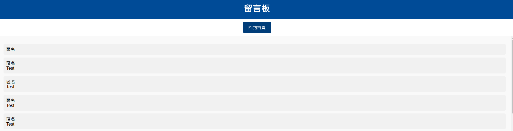

# Anonymous Message

這是一個`Google App Script`架設留言系統網站的範本，透過**Google試算表**的存取作為簡易DB，以網頁上瀏覽匿名留言板。




## 架構

主要文件有以下三個:

- Code.gs
- Index.html
- View.html

## 使用方法

### 1. 開啟 `APP Script`

首先打開[`APP Script`](https://script.google.com/home)，建立一個New Project，並幫它命名。

### 2. 建立文件

建立好Project後，並進入該Project，打開後會是編輯器的畫面。

接著在左側的欄位，點選新增檔案 >> 指令碼，並命名為`Code.gs`，並將內容複製過去。

再次點選新增兩個檔案 >> HTML，並分別命名為`Index.html`和`View.html`，並將內容複製過去。

### 3. 建立試算表

打開 [`Google 試算表`](https://docs.google.com/spreadsheets/)，並建立一個新試算表，並幫它命名。

在剛建好的試算表中，修改第一欄如下:

```
| Timestamp | Name | Message |
| ----------| ---- | ------- |
```

並重新命名底下的sheet名稱:

```text
Messages
```

### 4. 修改變數

回到 `Code.gs`，修改以下兩個參數:

- **SHEET_ID** 
  ```text
  在試算表的網址中，複製<SHEET ID>的部分。
  https://docs.google.com/spreadsheets/d/<SHEET ID>/edit
  ```
- **SHEET_NAME**:
  ```text
  輸入剛才重新命名的Sheet名稱:('Messages'為defalut)
  ```

### 5. 部屬

完成上面的步驟後，點選專案右上角的`部屬` >> `新增部屬作業` >> `網頁應用程式`。

**設定權限**: 可自行修改 

- `執行身分`: 我
- `誰可以存取`:所以人

確認部屬，即可獲得網址，就完成了。

#### 重新佈署

如果修改內容後，想要重新佈署，可點選`部屬` >> `管理部屬作業` >> 進行中 >> `編輯` >> `新版本` >> `部屬` 。

## Feature

歡迎大家自己上來玩(發發PR)，還有很多Feature可以加。

### TODO

- IsPublic: 是否顯示留言
- 顯示回復訊息
- 留言板的訊息排版
- 美化表面 (汗:CSS苦手)
